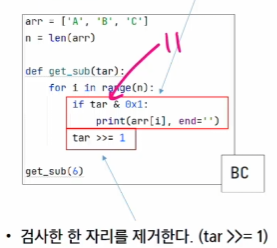

# SW 문제 해결 역량이란?
- 제약 조건과 요구사항을 이해, 최선의 방법을 찾아내는 능력
- **프로그래머가 사용하는 언어나 라이브러리, 자료구조, 알고리즘에 대한 지식을 적재적소에 퍼즐을 배치하듯 이들을 연결하여 큰 그림을 만드는 능력**
- 문제 해결 역량을 향상시키기 위해서 훈련이 필요하다.

## 문제 해결 과정
> 계약서
>1. 문제를 읽고 **이해**한다.
>2. 문제를 익숙한 용어로 재정의한다.
    
> 설계
>- 자료구조
>- 알고리즘
>3. 어떻게 해결할지 **계획**을 세운다.
>4. **계획을 검증**한다.

    
> 구현
> 
> 5. 프로그램으로 **구현**한다.
> 6. 어떻게 풀었는지 돌아보고, 개선할 방법이 있는지 찾아본다.

# 알고리즘?
- 문제를 해결하기 위한 절차나 방법
> - 1 + 2 + 3 + 4 + ... + 100 = 5,050
> - (1 + 100) * 100 / 2 = 5,050  
> - 아래 방법이 시간이 덜 걸림 더 **효율적임**
>

## 알고리즘의 효율
- 공간적 효율성
  - 연산량 대비 얼마나 **적은 메모리 공간**을 요하는가
- 시간적 효율성
  - 연산량 대비 얼마나 **적은 시간**을 요하는가 > 연산 횟수
- 효율성을 뒤집어 표현하면 *복잡도(Complexity)* 가 된다.
- 복잡도가 높을수록 효율성은 저하된다.


# 복잡도 분석
- Python은 1초 당 30,000,000
## 복잡도의 점근적 표기
- O(Big-Oh) - 표기 (최악의 경우)
- Ω(Big-Omega) - 표기 (최선의 경우)
- Θ(Big-Theta) - 표기 (평균적인 경우)

## O(Big-Oh) - 표기
- 복잡도의 **점근적 상한**을 나타낸다.
- 복잡도가 f(n) = 2n² - 7n + 4 이라면, O-표기는 f(n)의 O(n²)이다.
- 먼저 f(n)의 단순화된 표현은 n²이다.
- 단순화된 함수 n²에 임의의 상수 c를 곱합  cn²이 n이 증가함에 따라 f(n)의 상한이 된다.(단. c > 0)

#### 자주 사용하는 O-표기
- O(1) 상수 시간
- **O(log₂N)** 로그(대수) 시간
  - N이 10,000이고 O(logN)으로 짠 알고리즘이라면 몇 번 반복일까?
  - 약 14번 정도
- O(N) 선형 시간
  - N이 100이면 100번 돌아간다.
- **O(NlogN)** 로그 선형 시간
- O(N²) 제곱 시간
- O(N³) 세제곱 시간


#### 왜 효율적인 알고리즘이 필요한가?

- 효율적인 알고리즘이 슈퍼 컴퓨터 보다 낫다.
- 값비싼 H/W의 기술 개발보다 효율적인 알고리즘 개발이 훨씬 더 경제적이다.

# **진수(진법)**
## 2진수, 8진수, 10진수, 16진수
- 10진수: 사람이 사용하는 진수, 수 하나를 0~9로 표현
- 2진수: 컴퓨터 사용하는 진수, 수 하나를 0, 1로 표현
- 8진수: 2진수를 더 가독성 있게 사용(중요도 낮음)
- 16진수: 2진수를 더 가독성 있게 사용, 수 하나를 0, 1, ..., 8, 9, A, B, C, D, E, F로 표현
  - 왜 16진수를 사용하는것인가?
    - 2진수를 사람이 이해하기 편하도록 10진수로 변환시
      - 인간이 이해하기 편하지만, 연산이 오래 걸림
    - 2진수를 사람이 이해하기 편하도록, 16진수로 변환 시
      - 인간이 이해하기 어렵지만, 연산 속도가 매우 빠름
  - **구현하려면 계산기를 다룰 줄 알아야함**

- 용어 암기
  - HEX: 16진수
  - DEC: 10진수
  - OCT: 8진수
  - BIN: 2진수

#### 10진수 -> 타 진수로 변환
- 원하는 타진법의 수로 나눈 뒤 나머지를 거꾸로 읽는다.
- ex) 149를 2진수로 바꾸기
- 

###### 수기로 10진수 -> 2진수로 변환 해보기
- 수기로 74를 2진수로 변환하기
- ```python
    target = 74

    def dec_to_binary(target):
      binary_number = ""

      while target > 0:
        remain = target % 2 # 2로 나눈 나머지
        binary_number = str(remain) + binary_number
        target = target // 2 # 2로 나눈다.
      print(binary_number)

    dec_to_binary(target) # 1001010

    # 내장 함수로 있음
    # print(bin(74))
    # print(hex(74)) 
  ```

#### 10진수 -> 2진수로 변환하기
- 
- ```python
  -  def binary_to_decimal(binary_str):
      # 1. binary_str  문자열 뒤에서 부터 진행
      # 2. 각 자리에 맞는 수를 곱하면서, 결과에 더한다.
      decimal_number = 0
      pow = 0

      for digit in reversed(binary_str):
        if digit == '1'
          decimal_number += 2 ** pow
        else:
          pow += 1

      binary_to_deciaml("1001010") # 74
  ```
    

#### 10진수 -> 16진수로 변환하기
- ```python
  def decimal_to_hexadecimal(target):
    hex_digit = "0123456789ABCDEF"
    hexadecimal_number = ""

    while target > 0:
      remain = target % 16
      hex_number = hex_digit[remain] + hex_number
      target //= 16

    print(hex_number)
    decimal_to_hexadecimal(256) # 100
  ```

#### 16진수 <-> 2진수 변환
- 2진수, 10진수 간 변환은 연산이 많으나, 2진수 15진수 간의 변환은 연산이 없다.
- 진법 변환을 빠르게 할 수 있으려면, 하단 진수 표를 암기하는 것을 권장
- 

###### 진법 변환
- 연습 문제 풀기
- [도전] 10진수 -> 2진수 재귀 호출로 구현하기