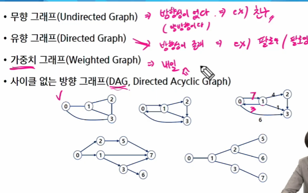

# 그래프의 기본
## 그래프
- 그래프는 아이템(사물 또는 추상적 개념)들과 이들 사이의 연결 관계를 표현한다.
- 그래프는 정점(Vertex)들의 집합과 이들을 연결하는 간선(Edge)들의 집합으로 구성된 자료구조
  - |V|: 정점의 개수, |E|: 그래프에 포함된 간선의 개수
  - |V|개의 정점을 가지는 그래프는 최대 |V|(|V|-1)/2 간선이 가능
    - ex) 5개의 정점이 있는 그래프의 최대 간선 수는 10(=5*4/2)개
- 선형 자료구조나 트리 자료구조로 표현하기 어려운 N:N 관계를 가지는 원소들을 표현하기에 용이함

### 그래프이 유형

- 완전 그래프
  - 정점들에 대해 가능한 모든 간선들을 가진 그래프
- 부분 그래프
  - 원래 그래프에서 일부의 정점이나 간선을 제외한 그래프

### 인접 정점
- 인접(Adjacency)
- 
  - 두 개의 정점에 간선이 존재(연결됨)하면 서로 인접해 있다고 함.
  - 완전 그래프에 속한 임의의 두 정점들은 모두 인접해 있다.

### 그래프 경로

- 경로란 간선들을 순서대로 나열한 것
  - 간선들: (0,2), (2,4), (4,6)
  - 정점들: 0 - 2 - 4 - 6
- 경로 중 한 정점을 최대한 한번만 지나는 경로를 **단순 경로**라 한다.
  - 0 - 2 - 4 - 6, 0 - 1 -6
- 시작한 정점에서 끝나는 경로를 **사이클(Cycle)**이라고 한다.
  - 1 - 3 - 5 - 1 

### 그래프 표현
- 간선의 정보를 저장하는 방식, 메모리나 성능을 고려해서 결정
- 인접 행렬(Adjacent matrix)
  - |V| x |V| 크기의 2차원 배열을 이용해서 간선 정보를 저장
  - 배열의 배열(포인터 배열)
- 인접 리스트(Adjacent List)
  - 각 정점마다 해당 정점으로 나가는 간선의 정보를 저장
- 간선의 배열
  - 간선(시작 정점, 끝 정점)을 배열에 연속적으로 저장

### 인접 행렬

- 두 정점을 연결하는 간선의 유무를 행렬로 표현
  - |V| x |V| 정방 행렬
  - 행 번호와 열 번호는 그래프의 정점에 대응
  - 두 정점이 인접되어 있으며, 그렇지 않으면 0으로 표현
  - 무향 그래프
    - *i*번째 행의 합 = *i*번째 열의 합 = Vⁱ의 차수
  - 유향 그래프
  -  행 *i*의 합 =  Vⁱ의 진출 차수
  -  열 *i*의 합 =  Vⁱ의 진입 차수
- 인접 행렬의 단점
  - 메모리 낭비가 심하다
    - 못가는 경로도 저장(메모리에 아무것도 담길 필요 없어도 일단 0넣음)

### 인접 리스트

- 각 정점에 대한 인접 정점들을 순차적으로 표현
- 하나의 정점에 대한 인접 정점들을 각각 노드로 하는 연결 리스트로 저장

## 그래프 순회(탐색)
- 그래프 순회는 비선구조인 그래프로 표현된 모든 자료(정점)를 빠짐없이 탐색하는 것을 의미
- 두가지 방법
  - 깊이 우선 탐색(Depth First Search, DFS)
  - 너비 우선 탐색(Breadth First Search, BFS)

# DFS
- 시작 정점의 한 방향으로 갈 수 있는 경로가 있는 곳까지 깊이 탐색해 가다가 더 이상 갈 곳이 없게 되면, 가장 마지막에 만났던 갈림길 간선이 있는 정점으로 되돌아와서 다른 방향의 정점으로 탐색을 계속 반복하여 결국 모든 정점을 방문하는 순회 방법
- 가장 마지막에 만났던 갈림길의 정점으로 되돌아가서 다시 깊이 우선 탐색을 반복해야 하므로 후입선출 구조의 스택 사용

> [!Note] 재귀의 장점
>  - 장점: 구현이 쉽다.(코테에서 중요)
>  - 단점: 나머지 다     

# BFS

- 너비우선탐색은 탐색 시작점의 인접한 정점들을 먼저 모두 차례로 방문한 후에, 방문했던, 정점을 시작점으로 하여 다시 인접함 정점들을 차례로 방문하는 방식
- 인접한 정점들에 대해 탐색을 한 수, 차례로 다시 너비우선탐색을 진행해야 하므로, 선입선출 형태의 자료구조인 큐를 활용함.

## 서로소 집합(Disjonit-sets)
- 서로소 또는 상호배타 집합들은 서로 중복 포함된 원소가 없는 집합들이다. 다시 말해 교집합이 없다
- 집합에 속한 하나의 특정 멤버를 통해 각 집합들을 구분한다. 이를 태표자(representative)라 한다.
- 상호배타 집합을 표현하는 방법
  - 연결 리스트
  - 트리
- 상호배타 집합 연산
- 
  - Make-set(x)
    - 자기 자신을 대표자로 설정 -> x개의 집합을 생성
  - Find-set(x)
    - 대표자가 누군지 찾는것
  - Union(x,y)
    - x, y를 하나의 집합으로 묶는 것

### 상호 배타 집합 표현 - 연결리스트

- 같은 집합의 원소들은 하나의 연결리스트로 관리한다
- 연결리스트이 맨 앞의 원소를 집합의 대표 원소로 삼는다
- 각 원소는 집합의 대표 원소를 가리키는 링크를 갖는다.

### 상호 배타 집합 표현 - 트리

- 하나의 집합(a disijoint set)을 하나의 트리로 표현한다.
- 자식 노드가 부모 노드를 가리키며 루트 노드가 대표자가 된다.
- 

### 상호 배타 집합에 대한 연산
- 연산의 효율을 높이는 방법
  - rank를 이용한 union
  - 
    - 각 노드는 자신을 루트로 하는 subtree의 높이를 랭크Rank라는 이름으로 저장한다
    - 두 집합을 합칠 때 rank가 낮은 집합을 rank가 높은 집합에 붙인다.
  - path compression(경로 압출)
    - Find-set을 행하는 과정에서 만나는 모든 노드들의 직접 root를 가리키도록 포인터를 바꿔준다.
    - 