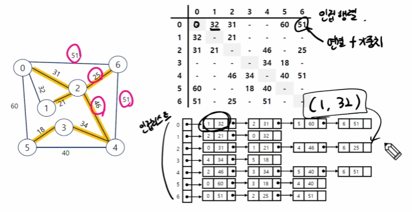
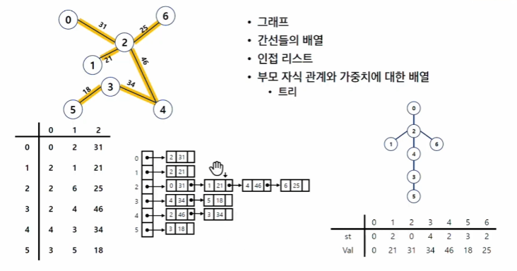
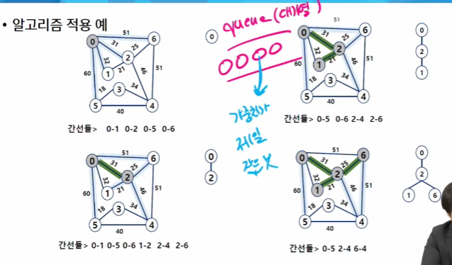

# 최소 신장 트리(MST)
- 그래프에서 최소 비용 문제
  - 모든 정점을 연결하는 간선들의 가중치의 합이 최소가 되는 트리(MST)
  - 두 정점 사이의 최소 비용의 경로 찾기(최단 거리)
- 신장 트리
  - n개의 정점으로 이루어진 양방향 그래프에서 n개의 정점과 n-1개의 간선으로 이루어진 트리
- 최소 신장 트리(Minimum Spanning Tree)
  - 무방향 가중치 그래프에서 신장 트리를 구성하는 간선들의 가중치의 합이 최소인 신장
  - 
  - 

> [!Note]
> **신장 트리**
> - 연결된 그래프 중
> 1. 모든 정점을 연결
> 2. n개의 정점과 n-1개의 간선으로 이루어짐. (n이 3 이상일 때 사이클이 안 생긴다.)
> - -> 하나의 그래프에서 여러 개가 나올 수 있다.
>
> **최소 (비용) 신장 트리**
> - 가중치의 합이 가장 작은 신장 트리

## MST 구현 방법
1. Prim 알고리즘
   - 특정 정점 기준 작은 것
2. Kruskal 알고리즘
   - 간선들 기준 작은 것

## Prim 알고리즘
- 하나의 정점에서 연결된 간선들 중에 하나씩 선택하면서 MST를 만들어 가는 방식
  - 1) 임의 정점을 하나 선택해서 시작
  - 2) 선택한 정점과 인접하는 정점들 중의 최소 비용의 간선이 존재하는 정점을 선택(가중치가 가장 작은 것)
  - 3) 모든 정점이 선택될 때 까지 1 - 2 과정 반복
- 서로소인 2개의 집합(2-disjoint-sets) 정보를 유지
  - 트리 정점들(tree vertices) - MST를 만들기 위해 선택된 정점들
  - 비트리 정점들(nontree vertices) - 선택되지 않은 정점들
- 

## Kruskal 알고리즘
- 간선을 하나씩 선택해서 MST를 찾는 알고리즘
  - 1) 최초, 모든 간선을 가중치에 따라 오름차순으로 정렬
  - 2) 가중치가 가장 낮은 간선부터 선택하면서 트리를 증가시킴
    - 사이클이 존재하면 다음으로 가중치가 낮은 간선 선택(같은 집합끼리 연결하면 사이클 발생)
  - n-1 개의 간선이 선택될 때까지 2 반복

### 시간 복잡도
- prim: O((V+E) logV)
  - 보통 정점보다 간선이 더 많다
    - > O(E logV)
    - 간선을 모두 고려하면서 우선순위 큐에 넣어야 함
    - 최적화된 Prim 알고리즘을 활용하면, 간선의 수가 많을수록 Prim 이 유리하다.
    - 즉, 밀집 그래프일수록 Prim 이 유리하다.
- 크루스칼: O(E logE)
  - 간선 위주로 정렬
- 다익스트라: O((V+E) logV)
  - 음수 + 양수가 섞인 문제는 못 품
  - 양수만 있는 그래프에서, 최대 거리는 풀 수 있다
    - 가중치를 모두 음수로 만들면 된다.
- -> 벨만 포드, 플로이드 워셜
  - 다익스트라로 해결 못하는 문제들을 풀기 위해 
  - 성능이 안 좋다
  - 구현이 쉽다

# 최단경로(Dijkstra)
- 최단 경로 정의
  - 간선의 가중치가 있는 그래프에서 두 정점 사이의 경로들 중에 간선의 가중치의 합이 최소인 경로
- 하나의 시작 정점에서 끝 정점까지의 최단 경로
  - 다익스트라(dijkstra) 알고리즘
    - 음의 가중치를 허용하지 않음
  - 벨만-포트(Bellman-ford) 알고리즘
    - 음의 가중치 허용
- 모든 정점에 대한 최단 경로
  - 플로이드-워샬(Floyd-washell) 알고리즘

## Dijkstra 알고리즘
- 시작 정점에서 거리가 최소인 정점을 선택해 나가면서 최단 경로를 구하는 방식이다.
- 시작 정점(s)에서 끝 정점(t)까지의 최단 경로에 정점 x가 존재한다.
- 이때, 최단 경로는 s에서 x까지의 최단 경로와 x에서 t 까지의 최단경로 구성된다.
- 탐욕 기법을 사용한 알고리즘으로 MST의 프림 알고리즘과 유사함.