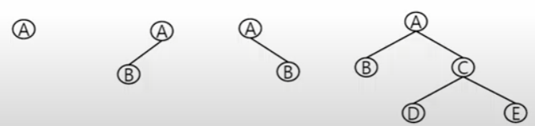
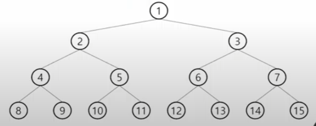
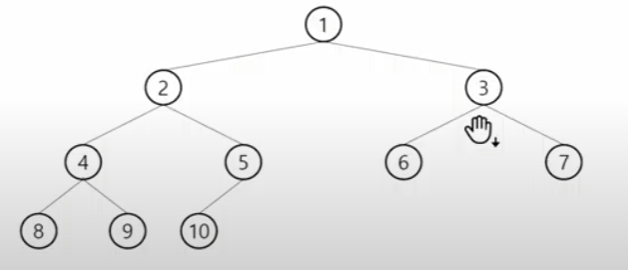
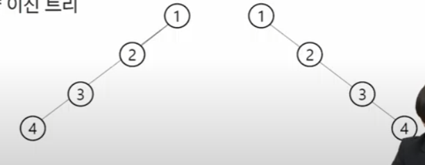
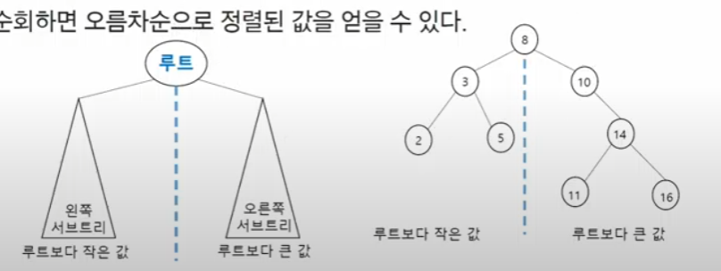
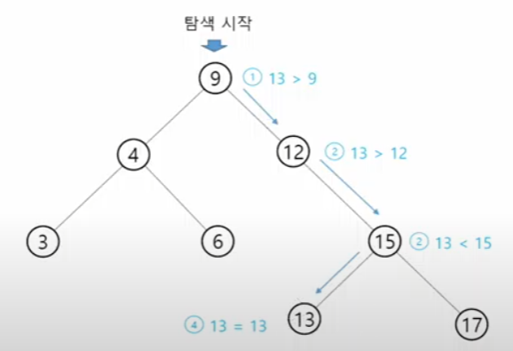
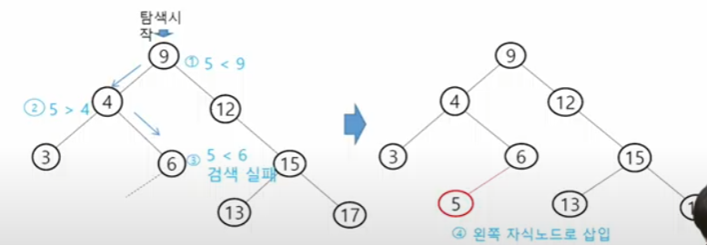
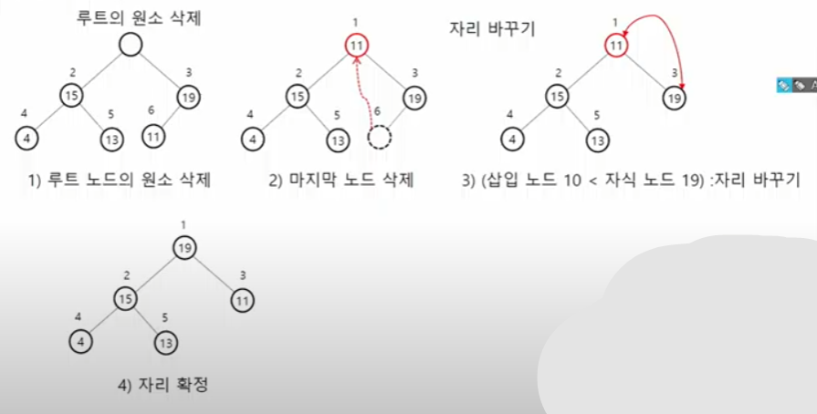

# 백트래킹 응용 & 그래프(트리)

## N-Queen 문제
> n x n 서양 장기판에서 배치한 queen들이 서로 위협하지 않도록 n개의 queen을 배치하는 문제
> - 어떤 두 Queen 도 서로를 위협하지 않아야 한다.
> - queen을 배치한 n개의 위치는?


## 백트래킹과 깊이 우선 탐색과의 차이
- 어떤 노드에서 출발하는 경로가 해결책으로 이어질 것 같지 않으면 더이상 그 경로를 따라가지 않음으로써 시도의 횟수를 줄임(Prunning 가지치기)
- 깊이 우선 탐색이 모든 경로를 추적하는데 비해 백트래킹은 불필요한 경로를 조기에 차단
- 깊이 우선 탐색을 가하기에는 **경우의 수가 너무나 많음** -> 유망하지 않은 경우의 수는 보지않는다. 즉 N! 가지의 경우의 수를 가진 문제에 대해 깊이 우선 탐색을 가하면 당연히 처리 불가능한 문제
- 백트래킹 알고리즘을 적용하면 일반적으로 경우의 수가 줄어들지만 이 역시 최악의 경우에는 여전히 지수함수 시간을 요하므로 처리 불가능 -> *정확한 시간 계산이 힘들다*
- 백트래킹 기법
  - 어떤 노드의 유망성을 점검한 후에 유망하지 않다고 결정되면 그 노드의 부모로 되돌아가 다음 자식 노드로 감
  - 어떤 노드를 방문하였을 때 그 노드를 포함한 경로가 해답이 될 수 없으면 그 노드는 유망하지 않다고 하며, 반대의 해답의 가능성이 있으면 유망하다고 한다.
  - 가지치기: 유망하지 않는 노드가 포함되는 경로는 더이상 고려하지 않는다.

## 연습 문제
- {1, 2, 3, 4, 5, 6, 7, 8, 9, 10}의 powerset 중 원소의 합이 10인 부분집함을 모두 출력하시오.
```python
#  level: N개의 원소를 모두 고려하면
# branch: 집합에 해당 원소를 포함 시키는 경우 or 안 시키는 경우 두가지
# 누적값 - 부부집합의 총합, 포함된 원소들
def recur(cnt, sum, subset):

  if sum > 10:
    return
  if cnt == 10:
    return 
  
  dfs(cnt + 1, sum+ data[cnt], subset + data[cnt]) # 포함하는 경우
  dfs( cnt + 1, sum, subset) # 안 하는 경우


path = []
data = [1, 2, 3, 4, 5, 6, 7, 8, 9, 10]
recur(0, 0, data)
```

## 트리
- 트리는 싸이클이 없는 무향 연결 그래프이다.
  - 두 노드(or 정점) 사이에는 유일한 경로가 존재한다.
  - 각 노드는 최대 하나의 부모 노드가 존재할 수 있다.
  - 각 노드는 자식 노드가 없거나 하나 이상이 존재할 수 있다.
- 비선형 구조
  - 원소들 간에 1:n 관계를 가지는 자료 구조

### 트리 정의
- 한개 이상의 노드로 이루어진 유한 집합이며 다음 조건을 만족한다.
  - 노드 중 부모가 없는 노드를 루트(root)라 한다.
  - 나머지 노드들은 n(>=0)개의 분리 집합 T1, T2, ..., TN으로 분리될 수 있다.
- **이들 T1, T2, ..., TN은 각각 하나의 트리가 되며(재귀적 정의) 루트의 서브 트리(subtree)라 한다.**

### 트리 용어

- 노드(node): 트리의 원소이고 정점(vertex)이라고도 한다.
  - 트리 T의 노드 - A, B, C, D, E, F, G, H, I, J, K
- 간선(edge): 노드를 연결하는 선
  - 부모 노드와 자식 노드를 연결
- 루트 노드(root node): 트리의 시작 노드
  - 트리 T의 루트 노드 - A
- 형제 노드(sibling node): 같은 부모 노드의 자식 노드들
  - B, C, D는 형제 노드
- 조상 노드: 간선을 따라 루트 노드까지 이르는 경로에 있는 모든 노드들
  - K의 조상 노드: F, B, A
- 서브 트리(subtree): 부모 노드와 연결되 간선을 끊었을 때 생성되는 트리
- 자손 노드: 서브 트리에 있는 하위 레벨의 노드들
  - B의 자손 노드 - E, F, K
- 차수(degree)
  - 
  - 노드의 차수: 노드에 연결된 자식 노드의 수
    - B의 차수 = 2, C의 차수 = 1
  - 트리의 차수: 트리에 있는 노드의 차수 중에서 가장 큰 값
    - 트리 T의 차수 = 3
  - 단말 노드(리프 노드): 차수가 0인 노드, 자식이 없는 노드
- 높이
  - 노드의 높이: 루트에서 노드에 이르는 간선의 수, 노드의 레벨
    -  B의 높이 = 1, F의 높이 = 2
 - 트리의 높이: 트리에 있는 노드의 높이 중에서 가장 큰 값. 최대 레발
   - 트리 T의 높이 = 3


# 이진 트리(binary tree)
- 모든 노드들이 최대 2개의 서브 트리를 갖는 특별한 형태의 트리
- 각 노드가 자식 노드를 최대한 2개 까지만 가질 수 있는 틜
  - 왼쪽 노드 자식 (left child node)
  - 오른쪽 노드 자식 (right child node)
- 
- 레벨 i에서의 노드의 최대 개수는 2ⁱ개
- 높이가  n인 이진 트리가 가질 수 있는 노드의 최소 개수는 (n+1)개가 되며 최대 개수는 (2ⁿ⁺¹-1)개가 된다.
  
## 포화 이진 트리(Full Binary Tree)
- 
- 모든 레벨에 노드가 포화 상태로 채워져 있는 이진 트리
- 높이가 h일 때, 최대의 노드 개수인(2ⁿ⁺¹-1)의 노드를 가진 이진 트리
  - 높이 3일 때 2³⁺¹-1 = 15 개의 노드
- 루트를 1번으로 하여 2ⁿ⁺¹-1까지 정해진 위치에 대한 노드 번호를 가짐.

## 완전 이진 트리(Complete Binary Tree)
- 
-  높이가 n이고 노드 수가 b개일 때, (단, 2ⁿ <= b < 2ⁿ⁺¹-1), 포화 이진 트리의 노드번호 1번부터 n번까지 빈 자리가 없는 이진 트리

## 편향 이진 트리
- 
- 높이 n에 대한 최소 개수의 노드를 가지면서 한쪽 방향의 자식 노드만을 가진 이진 트리
- 왼쪽 편향 이진 트리
- 오른쪽 편향 이진 트리

## 이진 트리-순회(traversal)
- 순회란 트리의 각 노드를 중복되지 않게 전부 방문하는 것을 말하는데 트리는 비선형 구조이기 때문에 선형구조에서와 같이 선후 연결관계를 알 수가 없다.
- 따라서 특별한 방법이 필요하다.
- 전위 순회/ 중위 순회/ 후위 순회
  - 전위 순회: 부모 left right
  - 중위 순회: left 부모 right
  - 후위 순회: left right 부모

# 이진 탐색 트리(BST)
- 
- 탐색 작업을 효율적으로 하기 위한 자료구조
- 모든 원소는 서로 다른 유일한 키를 가진다.
- key(왼쪽 서브 트리) < key(루트 노드) < key(오른쪽 서브 트리)
- 왼쪽 서브 트리와 오른쪽 서브 트리도 이진 탐색 트리다.
- 중위 순회하면서 오름차순으로 정렬된 값을 얻을 수 있다.

## 탐색 연산
- 
- 루트에서 탐색 시작
- 탐색할 키 값 x를 루트 노드의 키 값 k와 비교
  - x == k: 탐색 성공
  - x < k: 루트 노드의 왼쪽 서브 트리에 대해서 탐색연산 수행
  - x > k: 루트 노드의 오른쪽 서브 트리에 대해서 탐색연산 수행
- 서브 트리에 대해서 순환적으로 탐색 연산을 반복한다.
- 탐색 수행할 서브 트리가 없으면 탐색 실패

## 삽입 연산
- 
1. 먼저 탐색 연산을 수행
   - 삽입할 원소와 같은 원소가 트리에 있으면 삽입할 수 없으므로, 같은 원소가 트리에 있는지 탐색하여 확인한다.
   - 탐색에서 탐색 실패가 결정되는 위치가 삽입 위치가 된다.
2. 탐색 실패한 위치에 원소를 삽입한다.

## 삭제 연산
- 탐색 연산을 수행
- 리프 노드라면 그냥 지운다
- 리프 노드가 아니라면
  - 자식이 하나라면 부모와 자식을 연결
  - 자식이 둘이라면 왼쪽 서브트리 중 가장 큰 수 or 오른쪽 중 가장 작은 수를 올린다.

## 성능
- 탐색, 삽입, 삭제 시간은 트리의 높이만큼 시간이 걸린다.
  - O(h), h: BST의 깊이 (height)
- 평균의 경우
  - 이진 트리가 균형적으로 생성되어 있는 경우
  - O(log n)
- 최악의 경우
  - 한쪽으로 치우친 편향 이진 트리의 경우
  - O(n)
  - 순차 탐색과 시간 복잡도가 같다.

# 힙트리(heap tree)
> [!Note] 코드도 중요(heapq) ->  우선순위 큐
- 완전 이진 트리에 있는 노드 중에서 키 값이 가장 큰 노드나 키 값이 가장 작은 노드를 찾기 위해서 만든 자료 구조
- 최대 힙(max heap)
  - 키 값이 가장 큰 노드를 찾기 위한 **완전 이진 트리**
  - 부모 노드의 키 값 > 자식 노드의 키 값
  - 루트 노드: 키 값이 가장 큰 노드
- 최소 힙(min heap)
  - 키 값이 가장 작은 노드를 찾기 위한 **완전 이진 트리**
  - 부모 노드의 키 값 < 자식 노드의 키 값
  - 루트 노드: 키 값이 가장 작은 노드

## 힙 연산 - 삭제
- 
- 힙에서는 루트 노드의 원소만을 삭제 할 수 있다.
- 루트 노드의 원소를 삭제하여 반환한다.
- 힙의 종류에 따라 최대값 또는 최소값을 구할 수 있다.
  - 우선 순위 큐와 비교

# 힙의 활용
- 힙을 활용하는 대표적인 2가지 예는 **특별한 큐의 구현**과 **정렬**이다.
- 우선순위 큐를 구현하는 가장 효율적인 방법이 힙을 사용하는 것이다.
  - 노드 하나의 추가/삭제가 시간 복잡도가 O(logN)이고 최대값/최소값을 O(1)에 구할 수 있다.
  - 완전 정렬보다 관리 비용이 적다.

## 힙 정렬
- 힙 정렬은 힙 자료구조를 이용해서 이진 탐색과 유사한 방법으로 수행된다.
- 정렬을 위한 2단계
  - 1. 하나의 값을 힙에 삽입한다(반복)
  - 2. 힙에서 순차적(오름차순)으로 값을 하나씩 제거한다.
- 힙 정렬의 시간 복잡도
  - N개의 노드 삽입 연산 + N개의 노드 삭제 연산
  - 삽입과 삭제 연산은 각각 O(log N)이다.
  - 따라서 전체 정렬은 O(NlogN)이다.
- 힙 정렬은 배열에 저장된 자료를 정렬하기에 유용하다.